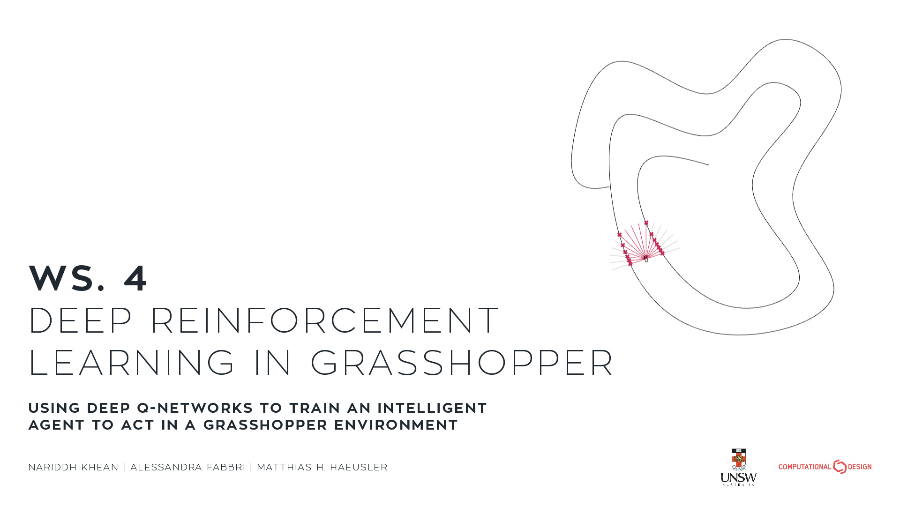
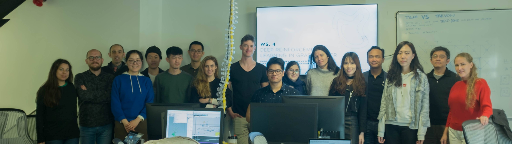

# Grasshopper_DQN

This is the official repository for the 2019 _CAADRIA_ workshop that took place at the Victoria University of Wellington, New Zealand, on the 13<sup>th</sup> and 14<sup>th</sup> of April: "__WS.4 Deep Reinforcement Learning in Grasshopper - Using Deep Q-Networks to Train an Intelligent Agent to Act in a Grasshopper Environment__".



## Workshop Chairs

- __Nariddh Khean__, Computational Design, _University of New South Wales_
- __Alessandra Fabbri__, Computational Design, _University of New South Wales_
- __M. Hank Haeusler__, Computational Design, _University of New South Wales_

## Workshop Description

Deep reinforcement learning (DRL), a subset of machine learning (ML), has seen incredible successes in game playing problems – most notable was the seminal triumph in 2015, where it exhibited beyond human-level performance playing _Atari_ games, and two years later when defeating the human world-champion in the board game, _Go_. Since then, DRL has become increasingly applied to more impactful applications, such as news recommendations, real-time advertisement, and drug design. As more DRL applications are being discovered, DRL has been identified as one of the most prominent and potentially disruptive ML trends for 2019.

A look at the built environment research landscape reveals a growing, yet small body of ML-related publications. Interrogating the [_CumInCAD_](http://papers.cumincad.org/) database, a repository of over 9600 conference papers within the computer-aided design (CAD) field, a search for "reinforcement learning" returned only 5 papers: one of which was published in 1995, two were from the same authors, and only one that could technically be considered as deep RL. The lack of DRL in CAD research is not due to a lack of research interest, as Google's Brain Robotics engineer Alex Irpan remarks that "[DRL has] attracted some of the strongest research interest I've seen”; rather, it is the combination of two factors specific to the field of the built environment:
- a lack of conceptual understanding, not just surrounding the mathematics and computation of DRL, but also how to assess the parameters of a given problem and identify if DRL is a suitable method, and
- a lack of readily available avenues to implement DRL in CAD software native to the built environment.

The goals of the workshop can be dichotomously categorised as theoretical and practical.

To gain a theoretical understanding of:
- how to identify when DRL is an appropriate method to solve a problem,
- how to frame a problem so that DRL can be suitably applied, and
- the nuances of adjusting inputs, reward schemas, and hyperparameters.

To gain practical, hands-on experience with:
- framing a problem as a DRL scenario in the parametric modelling environment Grasshopper,
- writing a novel python framework that uses a DRL algorithm known as 'deep Q-learning', and
- training the Grasshopper agent and evaluating its performance.

The problem at hand is to create an artificially intelligent agent to steer a car along a road network. The agent is not given any information about the road itself. Instead, all it sees are the parameters at which its "sightlines" intersect with the edges of the road. As such, a robustly trained agent should be able to navigate any reasonable road network. At the end of the workshop, participants were given an hour to train their own agent. After, collating everyone's best models, we had a race on a road I called "the Gauntlet"!

###### <br>_A race between four workshop participants and the neural networks they trained in an hour, at the end of the workshop._

## Getting Started

### Grasshopper

Grasshopper is a visual scripting language for the 3D modelling software, Rhino, which comes standard in [Rhino 6](https://www.rhino3d.com/). There are two Grasshopper plugins that are needed:
- [Hoopsnake](https://www.food4rhino.com/app/hoopsnake) which is used to get around Grasshopper's recursive loop avoidance check, and
- as the in-built `GH_Python` component uses Iron Python (yuck!), we used [GH_CPython](https://www.food4rhino.com/app/ghcpython), which allows us to implement CPython in Grasshopper.

### Python

The training of the DQN will be run on a local server built in [python 3.5](https://www.python.org/downloads/release/python-357/)/[3.6](https://www.python.org/downloads/release/python-368/), which will communicate with Grasshopper through sockets. Two Python libraries are used:
- the scientific computing library, [NumPy](https://www.numpy.org/), and
- the machine learning library, [TensorFlow](https://www.python.org/downloads/release/python-368/).

## Training

Before every training run starts, there are some pre-flight checks that need to be ticked off.
1. First, have the `training.gh` file in Grasshopper. Within that file, find the Hoopsnake component, right-click the component, and click 'reset'. This needs to be done every time the training process is restarted.
2. Open `training.py` in a text editor and make sure the two variables `INPUT_DIM` and `OUTPUT_DIM` are equivalent to the slider `Sight Line Count` and the number of items in the `Action` list in Grasshopper respectively.
3. Find the two GH_CPython components in the `training.gh` file, double click them, and make sure the `PORT` variable is one that is not being used already. Further, make sure the two port numbers are the same as those in the `training.py` file.

Once all those are square, we can start training! To start training the DQN, have Rhino and Grasshopper open with the `training.gh` file, and run `training.py` in a terminal. If everything is set up correctly, the terminal should output the following...
```
> python training.py
_________________________________________________________________
Layer (type)                 Output Shape              Param #
=================================================================
input_1 (InputLayer)         (None, 16)                0
_________________________________________________________________
dense (Dense)                (None, 64)                1088
_________________________________________________________________
dense_1 (Dense)              (None, 32)                2080
_________________________________________________________________
dense_2 (Dense)              (None, 16)                528
_________________________________________________________________
dense_3 (Dense)              (None, 3)                 51
=================================================================
Total params: 3,747
Trainable params: 3,747
Non-trainable params: 0
_________________________________________________________________
None
Model Initialised.

Start Loop in GH Client...
```
At this stage, find the HoopSnake component in the Grasshopper script, right-click it, and select 'Loop'. This should then start the training loop!

The terminal should output something along the lines of...
```
  ... connected.

  ITERATION: 1
  state       = [0.643712854056232, 0.696352339453148, 0.784533288702983, ...
  q-estimates = [0.043717995285987854, -0.17392410337924957, 0.1835426241159439]
  action      = 2 (epsilon)
  reward      = 0.2
  epsilon     = 0.796

  ITERATION: 2
  state       = [0.484029628340757, 0.524381259674292, 0.580696676398673, ...
  q-estimates = [0.13394702970981598, -0.1825016885995865, 0.27398931980133057]
```
... and so on. By default, every 50 iterations, a `.h5` file will be saved to a directory assigned in the parameters, which will be indicated in the terminal...

```
  -- MODEL SAVED (50.h5) --
```

These `.h5` files are what we care about. Within are the weights and biases of the neural network at that iteration of training. These `.h5` files will be used later during the deployment of the model, so don't worry if something goes wrong with the training process.

> Note: Resetting the training process and running it again will save `.h5` files with the same name, in the same directory, effectively overwriting previous models. If you want to preserve models, move the `.h5` files to a different directory.

By default, I've added a 10 second timeout for when the socket is waiting for data from Grasshopper, so that it doesn't hang indefinitely. If you receive the `socket.timeout: timed out` error, simply rerun the `training.py` file and start the loop in Grasshopper a tad quicker (or change the `TIMEOUT` parameter in the `training.py` file to something more manageable).

> Note: After every training run, don't forget the reset the hoopsnake component in Grasshopper!

## Deployment

(TODO: Deployment code and documentation).

## Parameters

### Grasshopper Parameters

| Parameter Name | Data Type | Default | Range | Description |
| -------------- | --------- | ------- | ----- | ----------- |
| `INPUT_DIM`    | integer   | 16      | > 0   | The number of input neurons in the neural network. This value should be the same as the `Sight Line Count` slider in Grasshopper. |
| `OUTPUT_DIM`   | integer   | 3       | > 0   | The number of output neurons in the neural network. This value should be the same as the number of actions stated in the `Actions` panel in Grasshopper. |

### Learning Algorithm Parameters

| Parameter Name    | Data Type | Default | Range    | Description |
| ----------------- | --------- | ------- | -------- | ----------- |
| `ALPHA`           | float     | 1       | > 0      | Effectively, learning rate. |
| `GAMMA`           | float     | 0.5     | > 0,<br>< 1 | Discount factor. The factor, which is consecutively multiplied by the highest predicted q-value (`q_s_a_d`) of the next state, that determines the worth the policy places on future rewards. The larger the `GAMMA`, the more the agent will favour long-term rewards. |
| `LAMBDA`          | float     | 0.005   | > 0,<br>< 1 | The rate at which `epsilon` decays. `epsilon`, used in the ε-greedy policy, allows the agent to conduct random actions, to balance exploitation with exploration. The larger the number, the faster `epsilon` decays. |
| `INITIAL_EPSILON` | float     | 0.8     | > 0,<br>< 1 | The value of `epsilon` at iteration 0. |
| `FINAL_EPSILON`   | float     | 0.05    | > 0,<br>< 1 | The minimum value of `epsilon` that it decays to. |
| `MAX_MEMORY`      | integer   | 10000   | > 0      | The maximum number of `(prev_state, action, reward, state_in)` tuples that are stored in memory before the oldest ones are removed. |
| `BATCH_SIZE`      | integer   | 64      | > 0      | The number of `(prev_state, action, reward, state_in)` tuples that are sampled from memory to undergo experience-replay. |

### Training Parameters

| Parameter Name    | Data Type | Default           | Range | Description |
| ----------------- | --------- | ----------------- | ----- | ----------- |
| `ITERATIONS`      | integer   | 2000              | > 0   | The number of iterations you would like your model to train for. |
| `TIMEOUT`         | integer   | 10                | > 0   | The time in seconds after the terminal outputs `Start Loop in GH Client...` to receive data from Grasshopper, before it times out. |
| `MODEL_SAVE_FREQ` | integer   | 50                | > 0   | The number of iterations between each time a model is saved to the model directory. |
| `MODEL_SAVE_PATH` | string    | 'D:\\DRL\\models' | -     | The path to the model directory, where all `.h5` files are saved. |

## Acknowledgements

As always, thank you to mu supervisors, Alessandra Fabbri and M. Hank Haeusler, who's constant guidance and encouragement made this workshop happen. Thank you to the CAADRIA team and the Victoria University of Wellington for holding a wonderful conference. And, a big thank you to the sixteen participants who came, participated, and helped me find my love of teaching. Hope to see you in the next one!

###### _Workshop Participants and Chair (from left to right): Marirena Kladeftira, Matthias Leschok, Spencer Steenblik, Siliang Lu, Gen Karoji, Jack Mao, Likai Wang, Maia Zheliazkova, Max Marschall, Nariddh Khean, Maryam Mianji, Tania Papasotiriou, Chryslin Lin, Aswin Indraprastha, Bing Zhao, Wei Yan, Kateryna Koniaeva._
